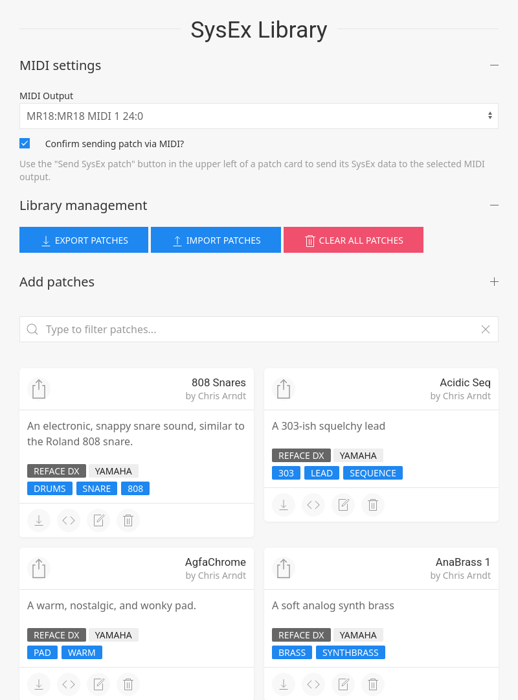

# SysEx Library SPA MVP

A single-page web application to manage the SysEx patches for your
MIDI devices from your mobile phone or tablet or your desktop browser.
Keep your patch library in your bag or pocket and send patches to your
MIDI devices even when on-the-go and off-line.

## Demo

Try the demo at <https://chrisarndt.de/sysex-library/>.

A browser with WebMIDI and SysEx support is required. Firefox and Chromium should work fine.

**Note:** you need to upload your own SysEx files to create patches. There are no patches
stored on the server, everything remains locally in your browser storage.

## Features

- Import SysEx files and save as patch with meta-data (name, author, tags, etc.).
- Send patch SysEx data via WebMIDI to selected MIDI output device
  (browser wih WebMIDI SysEx support required).
- Filter patches by name, author, device, manufacturer, and tags.
- Edit patch meta-data.
- Delete single or all patches.
- Export patch SysEx data as `.syx` file.
- Export patch with meta-data as JSON file.
- Export whole patch library or a selection of patches as JSON file.
- Import patch library from JSON file.
- Everything is stored on the user's device in the local browser storage (IndexedDB).
- Responsive layout ensures usability on all common screen sizes.

## Roadmap

This project is currently in a Minimal Viable Product (MVP) stage, i.e. it should already be 
usable and useful but not all planned features have ben implemented yet.

Ideas for future enhancements include:

- Turn into a proper PWA, which can run fully off-line after the first load.
- Extract meta-data from filename and SysEx data on import.
- Duplicate patch detection.
- Search explicitly by name, author, manufacturer, device and tag value, with exact matches and 
  logical operators.
- Save search filter history.
- Save and recall pre-defined search filters.
- Search result pagination.

## Authors

- Christopher Arndt ([@SpotlightKid](https://github.com/SpotlightKid))

## License

This project is released under the [MIT](https://choosealicense.com/licenses/mit/) license.
Please see the [LICENSE](./LICENSE.md) for details.

